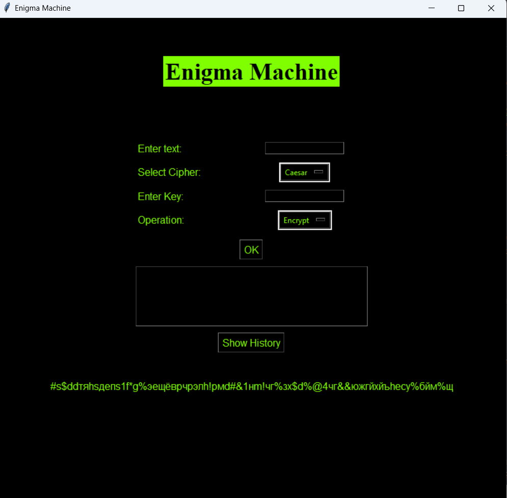
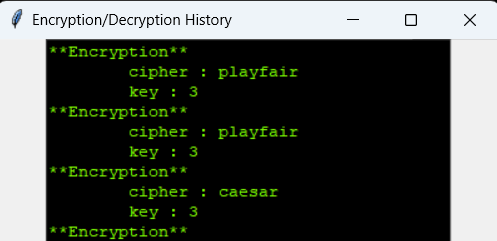

# Enigma Machine

first semester programming project

This is a simple GUI application for encrypting and decrypting text using Caesar, Playfair, and Vigenère ciphers.With a history button to help keep a track for multiple encryptions.




## How to Use

1. Enter the text you want to encrypt or decrypt.
2. Select the cipher type from the dropdown menu.
3. Enter the key.
4. Choose whether to encrypt or decrypt.
5. Click "OK" to see the result.
6. View the encryption/decryption history by clicking "Show History".

## Features

- Caesar Cipher
- Playfair Cipher
- Vigenère Cipher
- Dynamic Russian letter headline

## Installation

1. Clone the repository:
   ```bash
   git clone https://github.com/yourusername/enigma-machine.git
